A menu system that performs the following tasks:
1) Display the available interfaces on the router
2) Select an interface and display the IP address
3) Select an interface and display the MAC address
4) Display the uptime of the router
5) Display the disk usage and CPU utilisation of the router
6) Restart the networking service on the router
7) Restart the ssh service on the router
8) Enter a port number and run an nmap scan on this port
9) Return the value of the nmap scan
10) Display the different firewall zones
11) Display the config for each of the firewall zones
12) Reboot the router

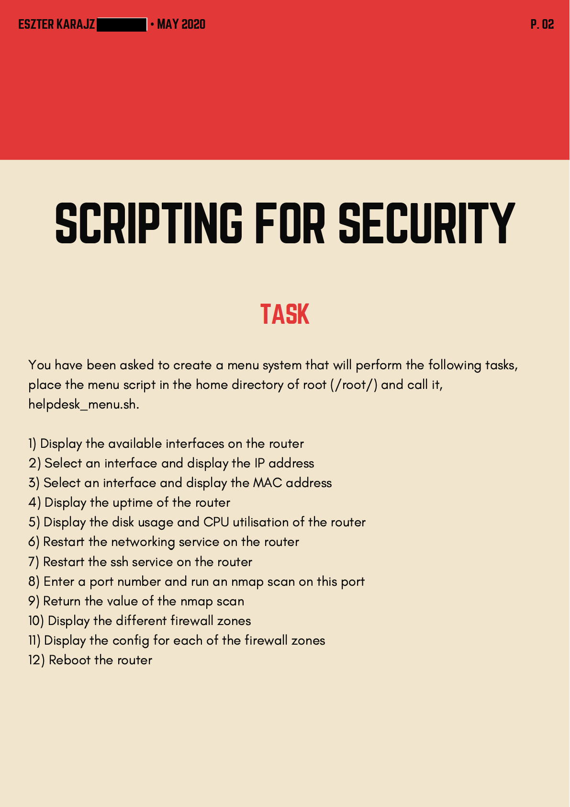
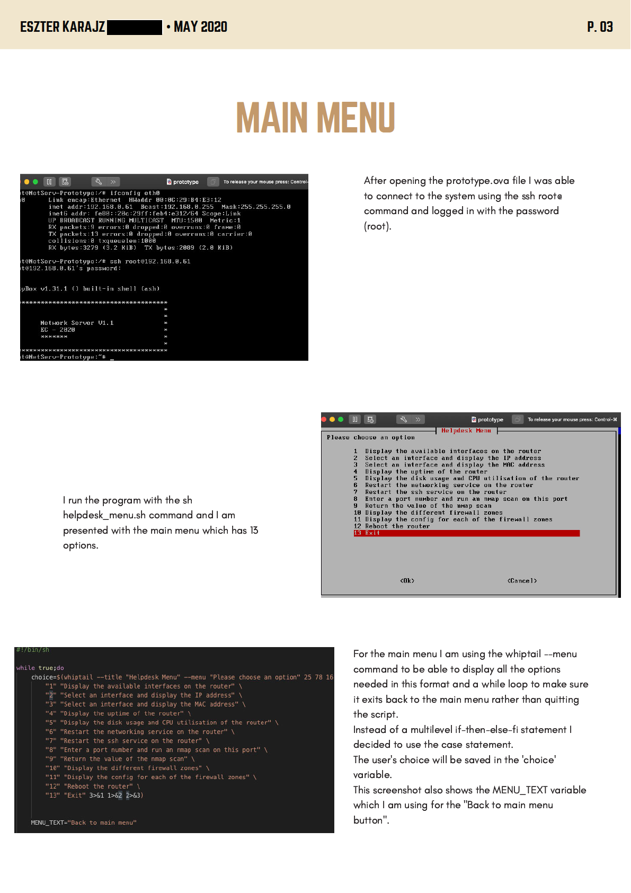
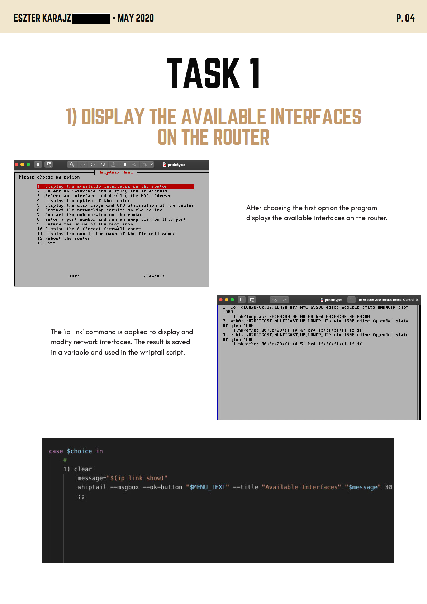
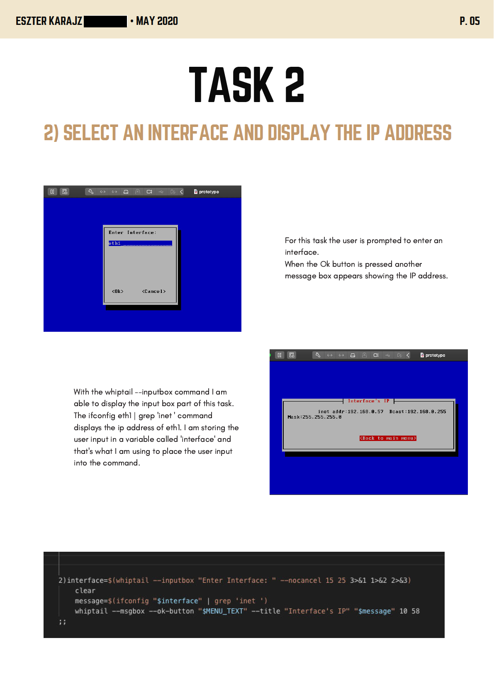
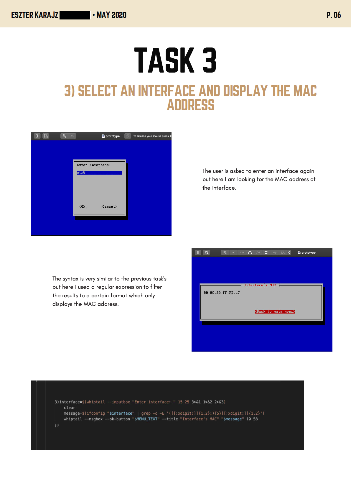
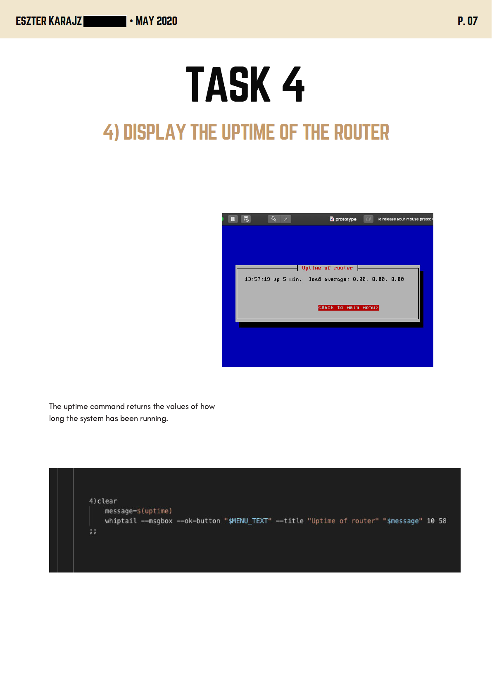
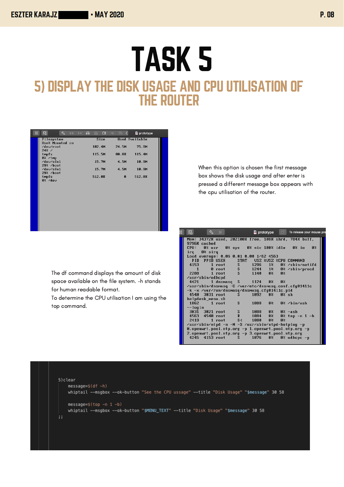
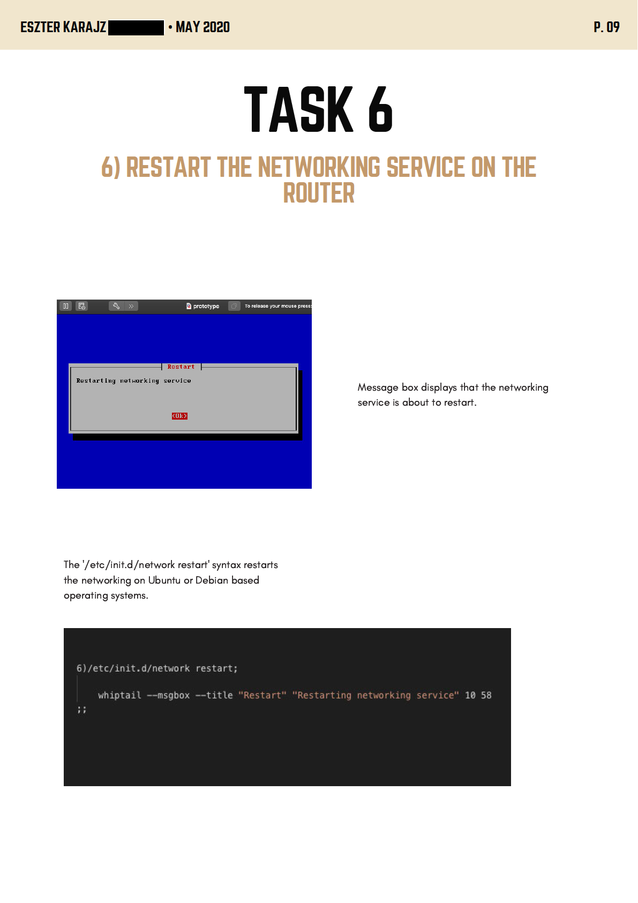
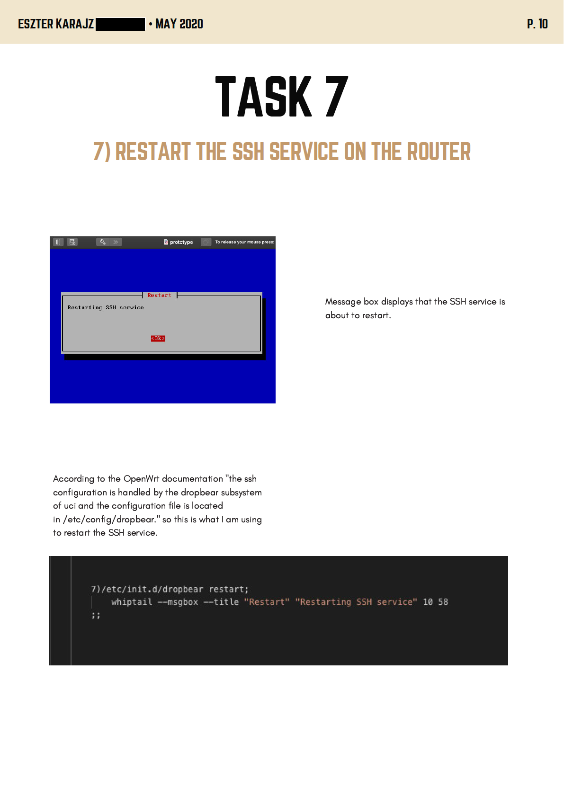
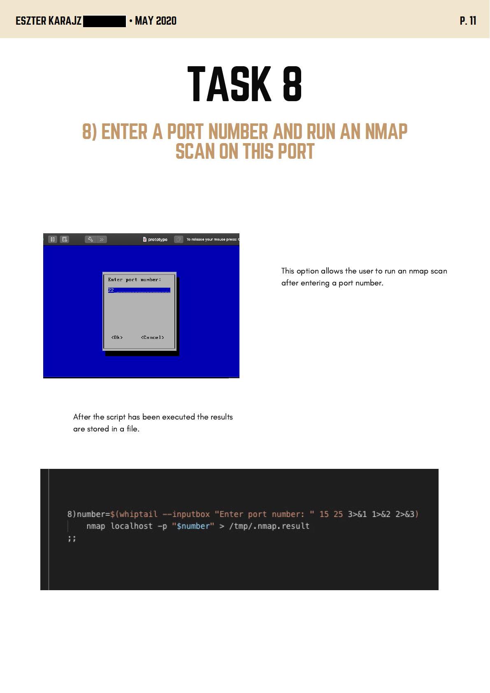
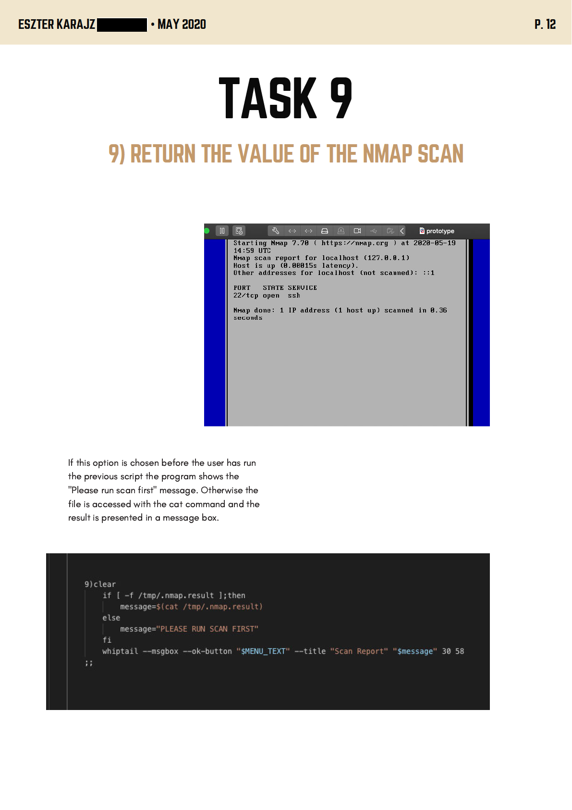
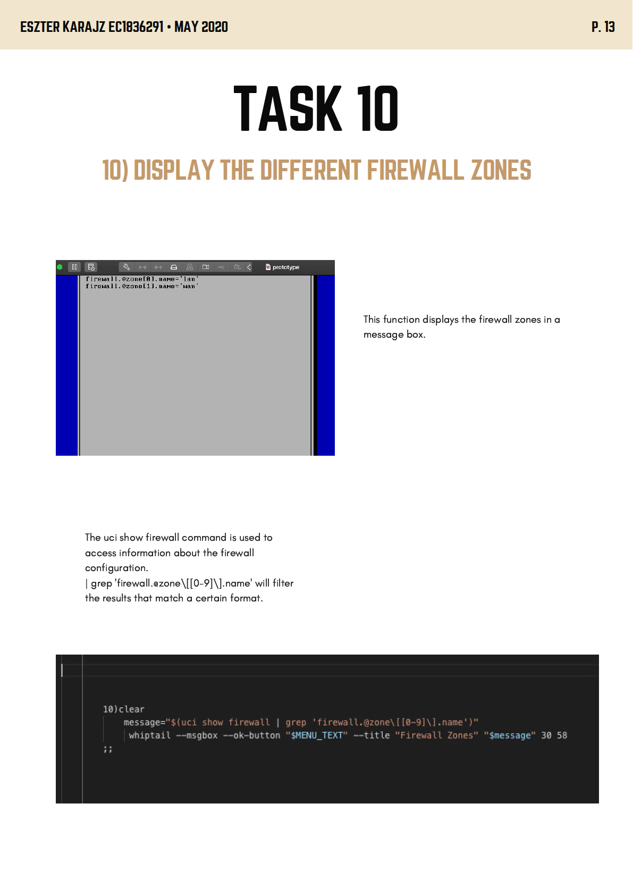
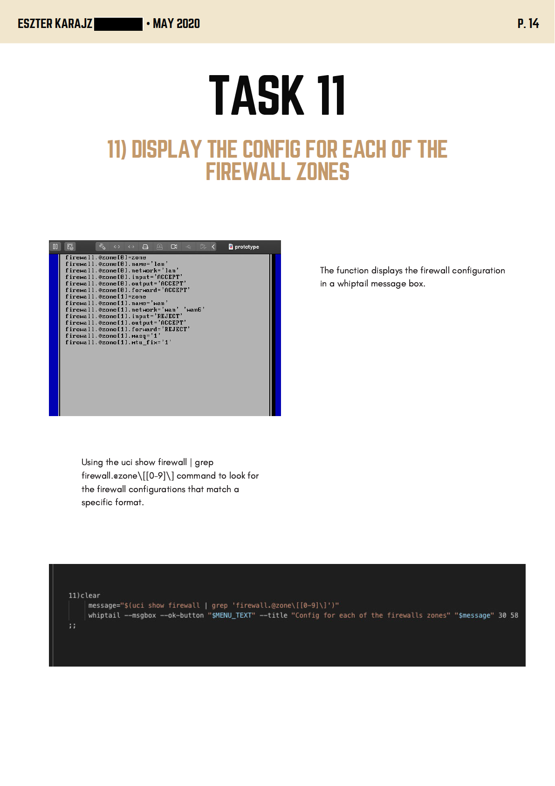
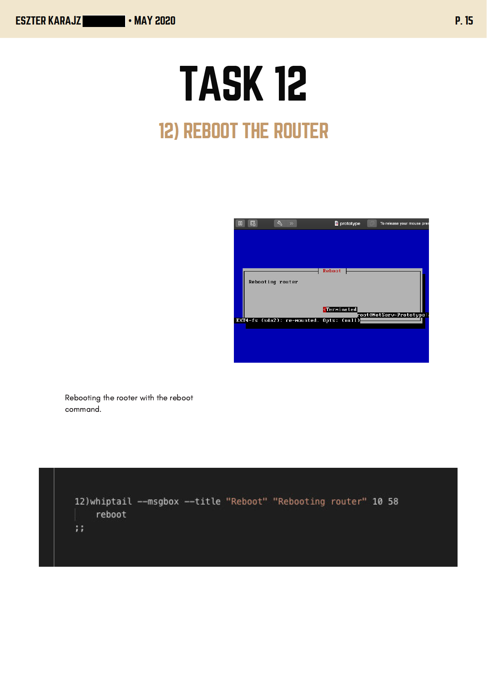
